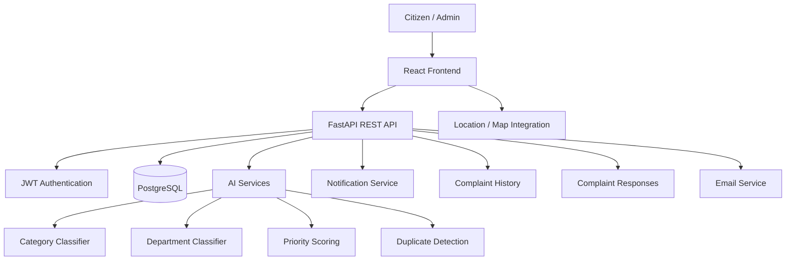

# CivicFix 🚨🏙️

**CivicFix** is a full-stack, AI-assisted civic complaint management platform designed to make reporting, tracking, prioritizing, and resolving local civic issues more structured and transparent.

Citizens can submit complaints with descriptions, photos, and location information. The backend processes complaints through AI-assisted classification, department assignment, priority scoring, and duplicate detection, while administrators can manage the complaint lifecycle, communicate with citizens, and monitor activity through dashboards and notifications.

---

## ✨ Key Features

### 👤 Authentication & Account Management
- User registration and login
- JWT-based authentication
- Email verification flow
- Forgot-password and reset-password flow
- Protected API routes
- Role-based access control

### 📝 Complaint Management
- Create civic complaints
- Upload complaint images
- Store complaint location information
- View complaint details
- Track complaint status
- Complaint history
- Complaint responses
- Citizen-specific complaint views

### 🤖 AI-Assisted Complaint Processing
CivicFix includes an AI/service layer for:

- Complaint category classification
- Department classification
- Priority scoring
- Duplicate complaint detection
- Classification confidence handling

### 🏢 Administrative Management
- Administrative complaint management
- Department assignment
- Status updates
- Complaint responses
- Complaint history tracking
- Dashboard statistics

### 🔔 Notifications
- Complaint-related notifications
- Status-change notifications
- Administrative response notifications
- Resolution notifications
- Notification management APIs

### 📊 Dashboard
- Complaint statistics
- Status-based information
- User-facing dashboard experience
- Administrative monitoring support

---

## 🧩 Complaint Lifecycle

```text
Reported
   ↓
Assigned
   ↓
In Progress
   ↓
Resolved
```

The lifecycle allows complaints to be tracked from initial submission through assignment, active handling, and resolution.

---

## 🏗️ System Architecture



---

## 🛠️ Tech Stack

### Frontend
- React
- Vite
- JavaScript / JSX
- CSS
- React-based page/component architecture

### Backend
- Python
- FastAPI
- SQLAlchemy
- Alembic
- JWT authentication
- Pydantic

### Database
- PostgreSQL

### AI / Intelligent Services
- Python-based AI service modules
- Complaint classification
- Department classification
- Priority scoring
- Duplicate detection

### Development & Version Control
- Git
- GitHub
- VS Code
- npm
- Python virtual environment

---

## 📁 Project Structure

```text
CivicFix/
│
├── backend/
│   ├── alembic/
│   │   └── versions/
│   │
│   ├── app/
│   │   ├── core/
│   │   │   ├── database.py
│   │   │   └── security.py
│   │   │
│   │   ├── models/
│   │   │   ├── user.py
│   │   │   ├── complaint.py
│   │   │   ├── complaint_history.py
│   │   │   ├── complaint_response.py
│   │   │   └── notification.py
│   │   │
│   │   ├── routes/
│   │   │   ├── auth.py
│   │   │   ├── complaints.py
│   │   │   ├── admin.py
│   │   │   ├── dashboard.py
│   │   │   ├── notifications.py
│   │   │   └── complaint_history.py
│   │   │
│   │   ├── schemas/
│   │   ├── services/
│   │   │   ├── ai/
│   │   │   │   ├── classifier.py
│   │   │   │   ├── department.py
│   │   │   │   ├── duplicate.py
│   │   │   │   └── priority.py
│   │   │   └── email.py
│   │   │
│   │   └── main.py
│   │
│   ├── alembic.ini
│   ├── requirements.txt
│   └── .env                 # local only
│
├── frontend/
│   ├── public/
│   ├── src/
│   │   ├── pages/
│   │   │   ├── Login.jsx
│   │   │   ├── Register.jsx
│   │   │   ├── Dashboard.jsx
│   │   │   ├── Complaints.jsx
│   │   │   ├── MyComplaints.jsx
│   │   │   ├── CreateComplaint.jsx
│   │   │   ├── ComplaintDetails.jsx
│   │   │   ├── ForgotPassword.jsx
│   │   │   ├── ResetPassword.jsx
│   │   │   └── VerifyEmail.jsx
│   │   ├── App.jsx
│   │   ├── App.css
│   │   └── main.jsx
│   │
│   ├── package.json
│   ├── vite.config.js
│   └── .env                 # local only
│
├── .gitignore
└── README.md
```

---

## 🚀 Getting Started

### 1. Clone the repository

```bash
git clone https://github.com/amitd5/CivicFix.git
cd CivicFix
```

---

# ⚙️ Backend Setup

### 2. Create and activate a Python virtual environment

```bash
cd backend

python3 -m venv venv
source venv/bin/activate
```

On Windows:

```powershell
venv\Scripts\activate
```

### 3. Install dependencies

```bash
pip install -r requirements.txt
```

### 4. Configure environment variables

Create:

```text
backend/.env
```

Keep secrets and credentials out of Git.

The backend environment should contain the database connection and the authentication/email/service configuration required by your local setup.

> Never commit real passwords, API keys, JWT secrets, or email credentials.

### 5. Run database migrations

```bash
alembic upgrade head
```

### 6. Start the backend

From `backend/`:

```bash
uvicorn app.main:app --reload
```

The local API is expected at:

```text
http://127.0.0.1:8000
```

FastAPI's interactive API documentation is available at:

```text
http://127.0.0.1:8000/docs
```

---

# 💻 Frontend Setup

Open a second terminal.

```bash
cd CivicFix/frontend
```

### 7. Install dependencies

```bash
npm install
```

### 8. Configure the API URL

Create:

```text
frontend/.env
```

Add:

```env
VITE_API_URL=http://127.0.0.1:8000
```

The frontend uses `VITE_API_URL` instead of hard-coding the backend address.

### 9. Start the frontend

```bash
npm run dev
```

The Vite development server runs on:

```text
http://localhost:5173
```

---

## 🔐 Security

CivicFix includes several application-level security measures:

- JWT authentication
- Protected API endpoints
- Role-based authorization
- Password hashing
- Authenticated user checks
- Complaint ownership/access controls
- Environment-based configuration
- Sensitive environment files excluded from Git
- Virtual environments excluded from Git
- Runtime uploads excluded from version control

Before production deployment, production secrets and infrastructure configuration must be supplied through the deployment platform's environment-variable system.

---

## 🔄 Typical User Flow

```text
Register
   ↓
Verify Email
   ↓
Login
   ↓
Create Complaint
   ├── Description
   ├── Photo
   └── Location
        ↓
AI Processing
   ├── Category
   ├── Department
   ├── Priority
   └── Duplicate Detection
        ↓
Complaint Submitted
        ↓
Admin / Department Assignment
        ↓
In Progress
        ↓
Response / Updates
        ↓
Resolved
        ↓
Notification
```

---

## 🧪 Development

### Backend

Run the API:

```bash
uvicorn app.main:app --reload
```

Run migrations:

```bash
alembic upgrade head
```

Create a new migration when the SQLAlchemy models change:

```bash
alembic revision --autogenerate -m "describe migration"
```

### Frontend

Start development server:

```bash
npm run dev
```

Build the frontend:

```bash
npm run build
```

---

## 🌍 Production Deployment

The project is structured so that the frontend and backend can be deployed independently.

A production deployment should include:

```text
React Frontend
      ↓
Production Backend URL
      ↓
FastAPI API
      ↓
Production PostgreSQL
```

Before deployment:

- Configure production environment variables
- Configure production CORS origins
- Use a production database
- Configure secure authentication secrets
- Configure persistent file storage
- Configure email delivery
- Run database migrations
- Build and test the frontend
- Test all critical user/admin flows

**Production/demo links will be added here after deployment.**

---

## 📸 Screenshots

Screenshots of the following flows can be added here:

- Login
- Registration
- Dashboard
- Create Complaint
- Complaint Details
- My Complaints
- Admin Dashboard
- Notifications
- Complaint Resolution

Example:

```text
docs/
└── screenshots/
    ├── login.png
    ├── dashboard.png
    ├── create-complaint.png
    ├── complaint-details.png
    └── notifications.png
```

---

## 🗺️ Roadmap

- [x] Authentication system
- [x] Email verification
- [x] Password reset
- [x] Complaint management
- [x] Complaint history
- [x] Complaint responses
- [x] AI classification
- [x] Department classification
- [x] Priority scoring
- [x] Duplicate detection
- [x] Notifications
- [x] Dashboard
- [x] Security hardening
- [x] Frontend polish
- [x] Environment-based frontend API configuration
- [ ] Automated test suite expansion
- [ ] Production deployment
- [ ] CI/CD pipeline
- [ ] Production monitoring

---

## 🎯 Why CivicFix?

Traditional complaint systems can make it difficult for citizens to understand:

- where a complaint was routed,
- what priority it received,
- whether it is being handled,
- what action was taken,
- and when it was resolved.

CivicFix brings these steps into a single workflow while using AI-assisted processing to help organize incoming complaints.

---

## 👨‍💻 Author

**Amit Dixit**

GitHub: [@amitd5](https://github.com/amitd5)

---

## 📄 License

A license has not yet been selected for this repository.

If you intend to allow others to reuse or modify the project, add an appropriate open-source license before presenting the repository as an open-source project.
